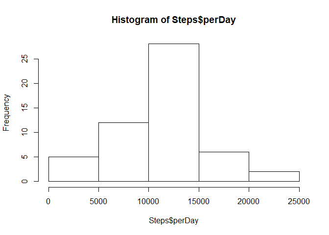
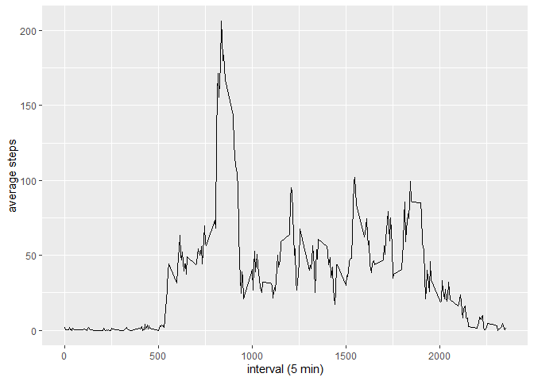
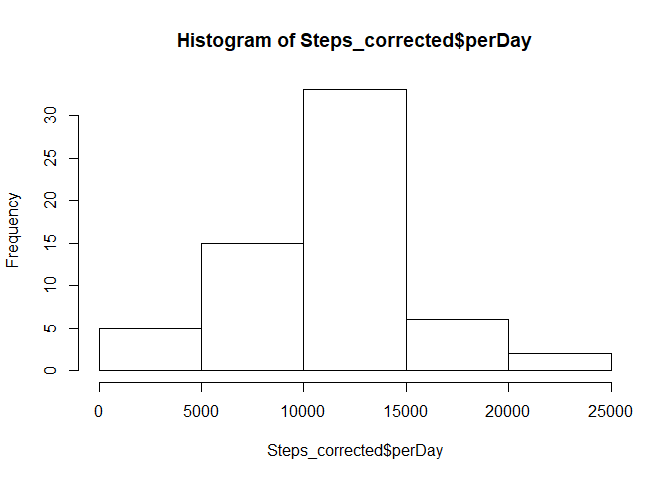
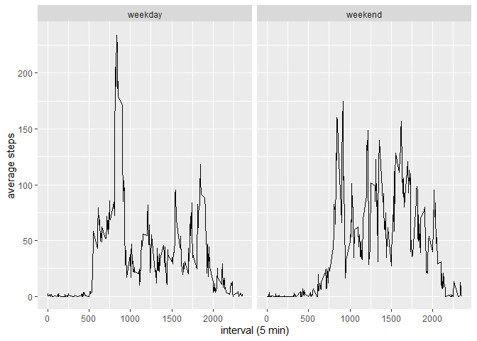

## Loading and preprocessing the data
1. Load the data (i.e. \color{red}{\verb|read.csv()|}read.csv())


```r
step_data <- read_csv(file = "C:/Users/demon/OneDrive/Documents/GitHub/RepData_PeerAssessment1/activity.csv", 
                    col_types = cols( 
                            steps = col_double(),
                            date = col_date(),
                            interval = col_double()))
```

## What is mean total number of steps taken per day (ignoring NAs)? 
1. Calculate the total number of steps taken per day


```r
Steps <- step_data %>% 
            group_by(date) %>%
            summarise(perDay = sum(steps))
```
2. Make a histogram of the total number of steps taken each day


```r
hist(Steps$perDay)
```

<!-- -->

3. Calculate and report the mean and median of the total number of steps taken per day


```r
summary(Steps$perDay)
```

```
##    Min. 1st Qu.  Median    Mean 3rd Qu.    Max.    NA's 
##      41    8841   10765   10766   13294   21194       8
```

## What is the average daily activity pattern?
1. Make a time series plot (i.e. \color{red}{\verb|type = "l"|}type = "l") of the 5-minute interval (x-axis) and the average number of steps taken, averaged across all days (y-axis)


```r
step_intervals <- step_data %>%
      group_by(interval) %>%
      summarise(ave = mean(steps, na.rm = TRUE))  


ggplot(step_intervals, aes(x=interval, y=ave)) +
      geom_line() + 
      xlab("interval (5 min)") +
      ylab("average steps")
```

<!-- -->

2. Which 5-minute interval, on average across all the days in the dataset, contains the maximum number of steps?


```r
filter(step_intervals, ave == max(ave))
```

```
## # A tibble: 1 x 2
##   interval   ave
##      <dbl> <dbl>
## 1      835  206.
```

## Imputing missing values

1. Calculate and report the total number of missing values in the dataset (i.e. the total number of rows with \color{red}{\verb|NA|}NAs)


```r
sum(is.na(step_data))
```

```
## [1] 2304
```

2. Devise a strategy for filling in all of the missing values in the dataset.

The strategy will be to relpace NAs with the average of that interval for that day of week.

3. Create a new dataset that is equal to the original dataset but with the missing data filled in.


```r
step_data_day <- step_data %>%
   mutate(date2 = ymd(date), day = wday(date2))

interval_day_ave_data <- step_data_day %>%
   group_by(day, interval) %>% 
   mutate(AveperDay = mean(steps, na.rm = TRUE)) %>%
   ungroup()

interval_list <- interval_day_ave_data$AveperDay %>% t()


steps_list <- step_data_day$steps %>% t()

corrected_data <- coalesce(steps_list, interval_list) %>% 
   as.data.frame( row.names = "steps_corr") %>% 
   gather(key, steps_corr, factor_key = FALSE) %>%
   select(steps_corr) %>% cbind(step_data_day)
```

4. Make a histogram of the total number of steps taken each day and Calculate and report the mean and median total number of steps taken per day.


```r
Steps_corrected <- corrected_data %>% 
            group_by(date) %>%
            summarise(perDay = sum(steps_corr))

hist(Steps_corrected$perDay)
```

<!-- -->

```r
summary(Steps_corrected$perDay)
```

```
##    Min. 1st Qu.  Median    Mean 3rd Qu.    Max. 
##      41    8918   11015   10821   12811   21194
```

## Are there differences in activity patterns between weekdays and weekends?

1. Create a new factor variable in the dataset with two levels – “weekday” and “weekend” indicating whether a given date is a weekday or weekend day.


```r
seq <- c(1:17568)
for (i in seq) {
      if(corrected_data$day[i] == 1 || corrected_data$day[i] == 7 ) 
            { corrected_data$week[i] <- "weekend" }
      else {
            corrected_data$week[i] <- "weekday" }
}
```

2. Make a panel plot containing a time series plot (i.e. \color{red}{\verb|type = "l"|}type = "l") of the 5-minute interval (x-axis) and the average number of steps taken, averaged across all weekday days or weekend days (y-axis).


```r
step_days_corr <- corrected_data %>%
      group_by(interval, week) %>%
      mutate(ave = mean(steps, na.rm = TRUE)) %>%
      ungroup()

ggplot(step_days_corr, aes(x=interval, y=ave)) +
      geom_line() + 
      facet_wrap(~ week) +
      xlab("interval (5 min)") +
      ylab("average steps")
```

<!-- -->

